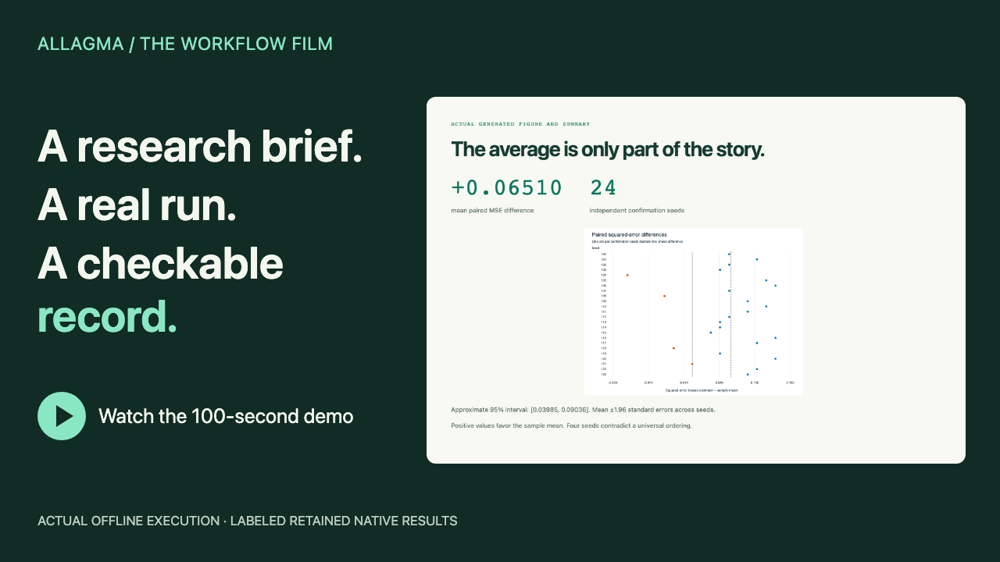
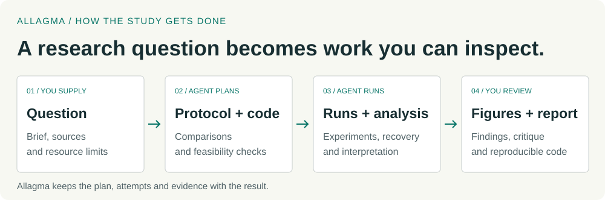

# Allagma

**Research workflows for coding agents.** Pin the plan, retain every attempt,
and connect claims to evidence you can inspect.

[First study](docs/guides/first-study.md) · [Native agent workflow](docs/guides/native-study.md) ·
[Real studies](docs/showcase/index.md) · [Contribute](CONTRIBUTING.md)

[](media/demo/allagma-workflow.mp4)

[Watch the full demo](media/demo/allagma-workflow.mp4) · [Transcript](media/demo/transcript.md) ·
[Captions](media/demo/allagma-workflow.en.vtt). Actual offline execution, followed
by clearly labeled retained native-study results; no accelerated computation.

A coding agent can write an experiment. Allagma gives it a reusable process for
leaving a checkable research record: which question it asked, which methods it
used, what failed, which measurements it included, and what the evidence supports.
Your study owns its science. Allagma carries the methods, locks and records.

**0.3.0rc2 is a source release candidate.** The offline core uses Python 3.11+
and the standard library on macOS or Linux. Native model sessions are optional.
[Release notes](docs/releases/0.3.0rc2.md) describe the exact qualified scope.

## Run your first study

No model account, paid API, GPU or Python package installation is needed. This
small checkout leaves the historical scientific archives out of the first download:

```sh
git clone --depth 1 --filter=blob:none --sparse https://github.com/alohays/allagma.git
cd allagma
git sparse-checkout set allagma adapters contracts methods recipes policies profiles \
  templates tools conformance examples/toy-study examples/first-research evals/context-retention
python3 -m allagma check
python3 -m allagma toy --destination work/my-first-study
```

If you already have a checkout, start with `python3 -m allagma check`. Until the
public launch, cloning requires repository access. Use a new destination for each
study; existing evidence is never erased. The [full tutorial](docs/guides/first-study.md)
explains every output and the example's finite limits.

The example asks whether adding 0.25 to a sample mean increases squared error.
It runs known-answer pilots and 24 new confirmation seeds, recovers from an actual
failure and interruption, and produces a figure, report and claim ledger.

| Generated finding | What the record says |
| --- | --- |
| Mean increase in squared error: **0.06510417** | Supported; approximate 95% interval [0.03985104, 0.09035729] |
| “Higher error on every seed” | Contradicted by four confirmation seeds |
| Leave-one-seed-out mean differences | All 24 remain positive |

Open `work/my-first-study/campaigns/toy-v1/analyses/a001/paper/manuscript.md`.
Its claims link to numerical outputs, included attempts and frozen inputs.
Then recompute and check the evidence:

```sh
python3 -m allagma campaign audit --study work/my-first-study --campaign toy-v1
```

The default example passes **521 evidence-reference checks**. This is a
known-answer workflow demonstration with approximate seed-level uncertainty,
not scientific novelty or a language-model quality benchmark.

## Use it for research you want to check later

- **Reproduce a computational paper.** Preserve the original task, code changes,
  failed attempts and exact answer checks. [CORE CULP](studies/core-culp/RESULTS.md)
  reproduced six answers and disclosed an upstream predictor-label defect.
- **Compare experimental choices.** Freeze the comparisons and independent units
  before interpreting the results. [Modular addition](studies/modular-addition/RESULTS.md)
  found an endpoint improvement without observing the prespecified grokking transition.
- **Investigate a training effect.** Keep pairing, uncertainty and qualifications
  beside the figure. The [EMA study](studies/ema-schedule/RESULTS.md) separates
  descriptive schedule effects from inconclusive duration and interaction effects.

For your own question, supply a brief, materials and finite resource profile.
[Prepare a native study](docs/guides/native-study.md) to let the agent develop the
scientific code and report through the pinned methods. Preparation is offline;
explicit native execution consumes your existing account's model usage.

## What has actually been tested

| Path | Evidence and boundary |
| --- | --- |
| Offline Python core | I1–I5 and 113 conformance tests; complete toy execution, recovery and recomputation |
| Native Codex | Actual CLI 0.160.1 sessions on the recorded macOS/M4 Pro environment; explicit method loading and locked routing |
| Claude Code | Packaging and contracts tested; native qualification is not claimed |
| Experimental composition | Full-record context and the replication recipe are explicit experiments; no model-quality improvement is claimed |

In the [twelve-session comparison](docs/v0.3/COMPARISON.md), **all twelve runs
completed the required science**. Allagma produced six complete evidence packages
out of six; plain Codex produced four out of six. The two gaps concern explicit
review-revision binding. This small local experiment does not establish general
research superiority or consistent time or token savings.

A deterministic audit is not independent scientific peer review. See
[host support](docs/host-support.md), [acceptance evidence](docs/acceptance.md)
and [resource limits](docs/resource-supervision.md) before extending a claim.

## Understand and extend it

<picture>
  <source media="(prefers-color-scheme: dark) and (max-width: 600px)" srcset="media/workflow-dark-mobile.svg">
  <source media="(max-width: 600px)" srcset="media/workflow-light-mobile.svg">
  <source media="(prefers-color-scheme: dark)" srcset="media/workflow-dark.svg">
  
</picture>

Start with [the concepts](docs/concepts.md). Methods are portable Agent Skills;
recipes compose them; adapters connect them to a host. A campaign pins its exact
bundle. Central changes cannot silently rewrite an existing study.
[Architecture](docs/architecture.md), [contracts](docs/contracts.md),
[study-owned programs](docs/study-adapters.md) and [versioning](docs/versioning.md)
cover the implementation. No hooks, subagents or project model pins are installed.

Small contributions need no provider account or GPU. See [contributing](CONTRIBUTING.md),
[starter tasks](docs/contributing/starter-tasks.md), [roadmap](ROADMAP.md),
[support](SUPPORT.md) and [security reporting](SECURITY.md).

Allagma core is **MIT licensed**. Scientific adaptations and archived dependencies
retain their own terms, including the AI Scientist license on EMA-derived code;
see [third-party notices](THIRD_PARTY_NOTICES.md). Cite the exact software version
using [CITATION.cff](CITATION.cff), and identify a study's bundle separately.
