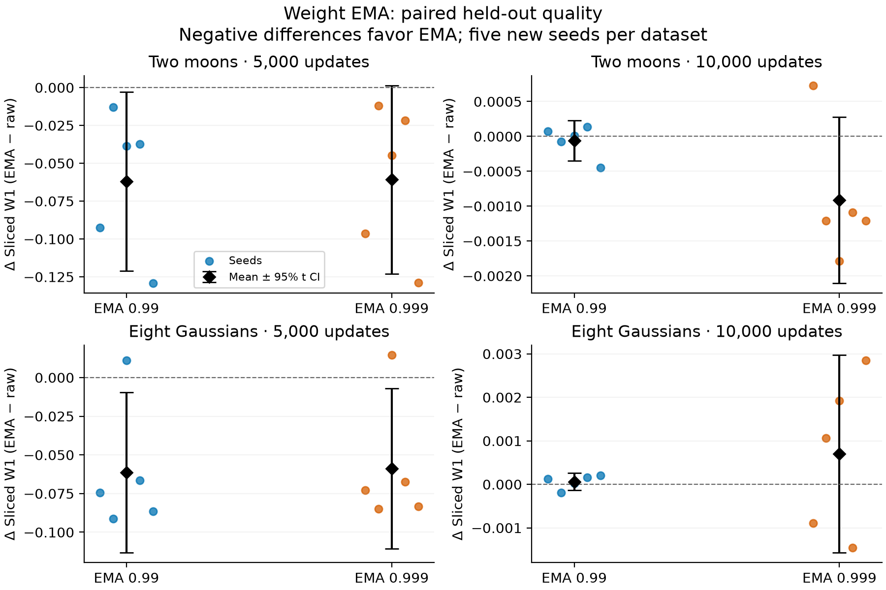
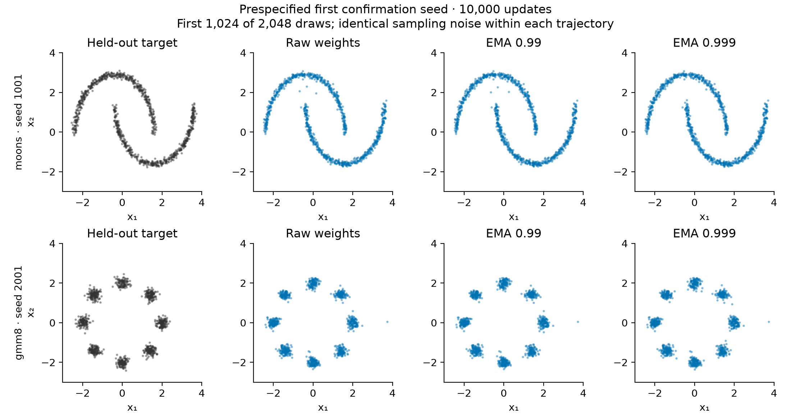

# When Does Weight EMA Help Tiny 2D Diffusion?

**Disclosure.** This study's code, analysis, figures and manuscript were machine-generated with OpenAI Codex, using an adaptation of SakanaAI/AI-Scientist's pinned 2D diffusion template. Measurements come from retained local MPS executions. No independent scientific peer review is claimed.

## Abstract

We compared raw and exponentially averaged weights on two moons and an eight-component Gaussian mixture, using 10 held-out confirmation trajectories after four pilot trajectories. Each trajectory provided raw, EMA 0.99 and EMA 0.999 samples at 5,000 and 10,000 updates. EMA had a lower observed mean Sliced W1 in 6 of eight dataset/checkpoint/decay comparisons. 3 unadjusted seed-level intervals were entirely below zero. These estimates describe this small, prespecified setting; they do not establish universal EMA superiority.

## Introduction

Weight averaging can suppress variation along an optimization trajectory, but its
lag may also preserve earlier, less useful weights. This study asks whether fixed
EMA decays of 0.99 and 0.999 improve held-out distribution quality at two training
budgets. It uses a small denoising diffusion model based on SakanaAI's pinned 2D
diffusion template [1] and the DDPM framework [2]. It is a bounded empirical
comparison and a native Codex workflow qualification, without a novelty claim.

## Methods

The residual MLP has 296,450 trainable parameters: three 256-wide residual
blocks, 128-dimensional sinusoidal embeddings for each coordinate and time,
and a two-dimensional noise prediction. Each seed uses a separately generated
100,000-point training set, AdamW with learning rate 0.0003, weight decay 0.01,
gradient norm clipping at 0.5, batch size 256 and cosine learning-rate decay over
10,000 updates. The 5,000-update checkpoint is an intermediate observation of
the same trajectory; it does not restart the learning-rate schedule. The model
uses 100 cosine-scheduled diffusion steps [3], posterior sampling noise and
predicted-clean-sample clipping to [-6,6]. The cosine schedule replaces the
reference's linear schedule, whose 100-step endpoint retains substantial signal.

The two-moons generator samples angle uniformly on each semicircle, adds
independent Gaussian noise with standard deviation 0.03, and applies the
reference's coordinate transforms. The equal-weight mixture has eight means on
a radius-two circle and isotropic standard deviation 0.15. For each seed,
training data, held-out data, minibatch/noise draws and sampling noise use
separate recorded random streams. Pilot seeds are 11 and 12 for moons and 21
and 22 for the mixture. Confirmation seeds are 1001–1005 and 2001–2005,
respectively. No pilot observation enters the confirmation estimates.

Both EMA copies start at the initial raw weights and update after every optimizer
step with the stated constant decay, without warmup or bias correction. No
separate EMA training is performed. At each checkpoint, all three variants use
the same 2,048 initial Gaussian draws and the same 99 subsequent noise arrays;
the same sampling stream is also used across checkpoints. Evaluation does not
consume training randomness. Checkpoint weights, generated samples and held-out
samples are retained. The executable protocol and its code hashes were prepared
before pilots; a post-pilot [confirmation freeze](../../confirmation-freeze.json)
records qualification and cost feasibility before any confirmation attempt.

The primary metric is empirical Sliced Wasserstein-1: the mean absolute
difference of sorted generated and held-out projections, averaged over 128
fixed random unit directions (projection seed 7321). Lower is better. Mixture
mode coverage counts a mode when at least 1% of all 2,048 generated samples lie
within 0.45 of its nearest center. We also retain the inlier fraction and the
half-L1 discrepancy of inlier mode mass from uniform mass; the latter includes
missing/outlier mass and is not a normalized categorical total-variation distance.

Each EMA-minus-raw comparison is paired within training seed. Its uncertainty is
a two-sided 95% Student t interval over five seed differences (four degrees of
freedom). All eight intervals are unadjusted and descriptive. Exact two-sided
sign-flip p-values are sensitivity summaries under sign exchangeability; with
five pairs their minimum is 0.0625. Leave-one-seed-out means and an independent
held-out-versus-held-out distance are retained in the numerical summary.
Checkpoints, generated points and projections are not independent replicates.

All scientific computation runs in a pinned study-owned Python environment on
the local Apple M4 Pro with 48 GB unified memory. Training and sampling use
MPS float32; metrics use CPU float64. The study-wide ceiling is 1,800 seconds,
including failed checks, interruptions, retries and recomputation, and at most
18 training attempts. The earlier 15.3-second feasibility estimate is charged
conservatively to that ceiling and is not scientific evidence. Software and
device details are recorded per attempt. Identical cross-platform training
weights are not promised [4].

## Results

The observed benefit was concentrated at 5,000 updates: the four mean paired differences ranged from -0.062092 to -0.058828. At 10,000 updates they ranged from -0.000915 to 0.000699, and every interval included zero. Observed mixture mode counts ranged from 8 to 8 across all confirmation variants and checkpoints. A zero observed difference and a collapsed t interval for this saturated count do not establish population equivalence.

EMA had a lower observed mean Sliced W1 in 6 of eight dataset/checkpoint/decay comparisons. 3 unadjusted seed-level intervals were entirely below zero. Table 1 includes every prespecified comparison. The exact
per-seed data and all interval calculations are available in the linked artifacts.

| Dataset | Updates | EMA | Mean Δ W1 | 95% t interval | Seeds improved | Sign-flip p |
| --- | ---: | --- | ---: | --- | ---: | ---: |
| moons | 5,000 | ema099 | -0.062092 | [-0.121117, -0.003068] | 5/5 | 0.0625 |
| moons | 5,000 | ema0999 | -0.060764 | [-0.122907, 0.001379] | 5/5 | 0.0625 |
| moons | 10,000 | ema099 | -0.000061 | [-0.000348, 0.000225] | 2/5 | 0.8125 |
| moons | 10,000 | ema0999 | -0.000915 | [-0.002105, 0.000276] | 4/5 | 0.1250 |
| gmm8 | 5,000 | ema099 | -0.061503 | [-0.113301, -0.009705] | 4/5 | 0.1250 |
| gmm8 | 5,000 | ema0999 | -0.058828 | [-0.110551, -0.007105] | 4/5 | 0.1250 |
| gmm8 | 10,000 | ema099 | 0.000062 | [-0.000133, 0.000258] | 1/5 | 0.4375 |
| gmm8 | 10,000 | ema0999 | 0.000699 | [-0.001574, 0.002972] | 2/5 | 0.4375 |

**Figure 1.** Dots show individual seed differences; black diamonds and bars show
the paired mean and unadjusted 95% t interval. Negative differences favor EMA.
The complete numerical source is [paired-differences.csv](../../campaigns/ema-v1/analyses/a001/outputs/paired-differences.csv).

| Updates | EMA | Mean Δ covered modes | 95% t interval | Mean Δ inlier fraction |
| --- | --- | ---: | --- | ---: |
| 5,000 | ema099 | 0.000 | [0.000, 0.000] | 0.0024 |
| 5,000 | ema0999 | 0.000 | [0.000, 0.000] | -0.0023 |
| 10,000 | ema099 | 0.000 | [0.000, 0.000] | 0.0002 |
| 10,000 | ema0999 | 0.000 | [0.000, 0.000] | -0.0003 |

**Table 2.** Paired mixture mode-coverage differences and inlier-fraction changes.
Mode counts can saturate at eight even when distribution quality differs, so
coverage is interpreted alongside Sliced W1 and inlier fraction.

**Figure 2.** The first 1,024 draws from the smallest prespecified confirmation
seed for each dataset at 10,000 updates. Seed selection was specified before
confirmation and does not depend on visual quality. All 2,048 draws enter metrics.

## Discussion and limitations

Checkpoint age and learning-rate position change together in this one cosine-decay training trajectory. The observed early-versus-late pattern therefore does not isolate training duration from the optimizer schedule. The independent verification is split into primary metric/weight checks and a separate supporting-diagnostics check; neither is independent scientific peer review.

The answer to when EMA helps must be conditioned on dataset, checkpoint and
decay. The paired design isolates weight selection on each realized training
trajectory and reduces sampling noise in comparisons. It does not separate all
sources of training and evaluation variability. Five seeds give limited power,
and the exact sign-flip analysis cannot reject at the two-sided 5% level even
if every difference has the same sign. Unadjusted t intervals assume a suitable
seed-level mean approximation and are not simultaneous guarantees. Choosing
the best observed decay after these comparisons requires new confirmation.

These synthetic distributions, the selected scale and clipping bound, one
optimizer schedule and one small MLP do not establish general behavior for
image diffusion. A coverage count alone does not measure correct mixture
weights. The finite-sample reference distance estimates a measurement floor,
not a correction subtracted from model scores. Real native activation and
fresh-session recovery are workflow evidence; they do not establish general
research quality or independent scientific peer review.

## Reproducibility and evidence

[Summary](../../campaigns/ema-v1/analyses/a001/outputs/summary.json), [per-seed metrics](../../campaigns/ema-v1/analyses/a001/outputs/per-seed.csv),
[raw manifest](../../campaigns/ema-v1/analyses/a001/raw-manifest.json), [analysis record](../../campaigns/ema-v1/analyses/a001/record.json),
[claim ledger](claims.json), [frozen protocol](../../campaigns/ema-v1/protocol.json), and
[reference provenance](../../reference/provenance.json) identify the
inputs and dependencies. The study [README](../../README.md) provides
environment recreation, metric/figure recomputation and training commands.
Interrupted and failed attempts remain in the campaign and are explicitly
excluded. The separate host report distinguishes observed native behavior from
deterministic evidence checks.

This reporting revision adds claim records for Table 2 and the checkpoint-pattern interpretation. The [supporting verification](../../evidence/supporting-verification.json) independently checks mode/inlier summaries, finite-sample controls and leave-one-seed-out diagnostics. [Publication provenance](record.json) retains the prior draft and publication, scripts and exact evidence. No training result or frozen numerical analysis was changed.

## References

1. SakanaAI. AI-Scientist, `templates/2d_diffusion`, commit
   `1de1dbc1f4ee2c5f61e9c94348d55eb51d7fa2eb`.
   [Pinned source](https://github.com/SakanaAI/AI-Scientist/tree/1de1dbc1f4ee2c5f61e9c94348d55eb51d7fa2eb/templates/2d_diffusion).
2. Ho, J., Jain, A., and Abbeel, P. (2020). Denoising Diffusion Probabilistic Models.
   [arXiv:2006.11239](https://arxiv.org/abs/2006.11239).
3. Nichol, A., and Dhariwal, P. (2021). Improved Denoising Diffusion Probabilistic Models.
   [arXiv:2102.09672](https://arxiv.org/abs/2102.09672).
4. PyTorch. Reproducibility, version 2.14 documentation.
   [Official documentation](https://docs.pytorch.org/docs/2.14/notes/randomness.html).
