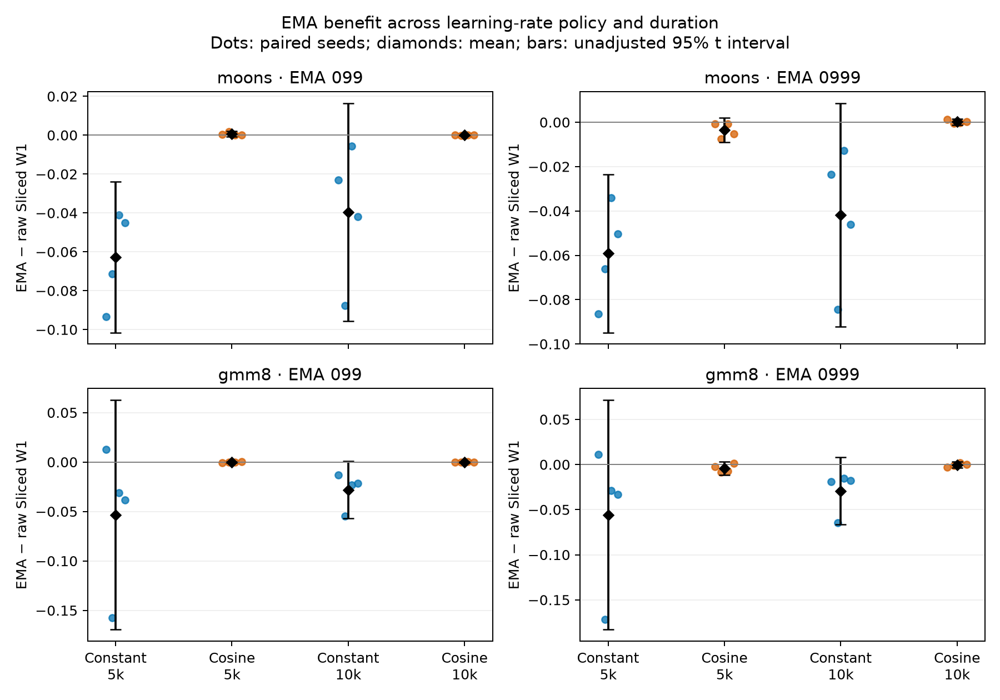

# When does weight averaging help tiny diffusion models?

<a id="verified-ema-duration-schedule-follow-up"></a>

A native Codex session used Allagma to compare training duration and learning-rate
policy, producing scientific code, saved model states, statistical estimates,
this figure and a report. The result below is retained work from run r07.

EMA's mean relative benefit was larger under constant learning rate than at
completed cosine endpoints. Define Δ = SW1(EMA) − SW1(raw), with negative values
favoring EMA. The schedule contrast Δ(cosine) − Δ(constant) was positive in all
eight dataset/decay/duration comparisons. Raw-weight mean SW1 also improved
under cosine in every dataset/duration comparison, while absolute EMA means
changed less. A smaller *relative benefit* therefore does not imply worse
absolute EMA quality.



[Open the full-size figure](https://alohays.github.io/allagma/generated/media/evidence/ema-r07.png).

Dots are the four paired seeds; diamonds and bars are means and unadjusted 95%
Student t intervals. The figure's `EMA 099` and `EMA 0999` labels mean decays
0.99 and 0.999. Each panel has its own scale. With four seeds, intervals are
imprecise, multiplicity is substantial, and zero-containing intervals do not
establish equality. The intervention is the complete learning-rate path; the
study does not isolate a mechanism caused solely by its terminal value.

| Finding | Observed result |
| --- | --- |
| Cell-level mean Δ below zero | 14/16 |
| Unadjusted cell-level 95% t intervals wholly below zero | 2/16, both moons at constant 5k |
| Schedule-contrast means above zero | 8/8 |
| Duration-contrast intervals containing zero | 8/8 |
| Interaction intervals containing zero | 4/4 |
| GMM8 mode coverage | All 48 states covered all eight modes; this is a ceiling effect |

## Execution and verification

The first fully verified Allagma package in frozen run order is **r07**
(replicate 2). It is the illustrative package selected by the prespecified rule.
The [workflow comparison is complete](../../docs/v0.3/COMPARISON.md); this
individual result does not establish an Allagma advantage over plain Codex.

All **32 required cells and 96 raw/EMA model states** were completed on this
Mac's MPS backend. There are four independent seeds per dataset. The 24 actual
training trajectories total 200,000 updates: each constant-rate trajectory
supplies its 5k and 10k endpoints, while cosine-5k and cosine-10k are separately
trained from identical initial states and training-input prefixes.

The unchanged frozen scorer passes **240/240 checks**, including replay of all
96 states from saved weights and recorded generation noise. Independent
controller checks regenerate every seed's initial weights and input streams,
verify paired hashes and all terminal optimizer counters, and reproduce 114
statistical summaries. See the [score](../../evals/research-v0.3/runs/r07/score.json),
[independent audit](../../evals/research-v0.3/runs/r07/independent-analysis.json),
and [eight-item evidence review](../../evals/research-v0.3/runs/r07/substantive-review.json).

The agent recovered the controlled interruption and an MPS initialization failure
without coordinator guidance. Its study runner lowered the allocator's low
watermark to 0.1 while preserving the broker's high cap of 0.2. The shared
framework's separately validated rc2 correction now passes actual full-broker
MPS checks; the original frozen outcome is unchanged. Charged
compute was 362.39 seconds, setup 20.43 seconds and native wall time 1,511.68
seconds, with 35 compute requests. Failures remain retained. The same-assistant
critique and controller audit are provisional, not independent scientific peer
review. AI-generated/adapted code and reporting are disclosed, with the supplied
AI Scientist Source Code License retained.

[Read the agent's full report](../../media/evidence/ema-r07-report.md). This exact
selected copy retains its source license and disclosure; its relative references
resolve inside the full package below.

## Restore and reproduce

The [package index](../../evals/research-v0.3/runs/r07/package/package-index.json)
retains the exact source, protocol, actual training inputs, weights, samples,
traces, statistics, report and revision-bound critique. Its 829,100,336-byte
archive is split into 25 parts; software wheels are hydrated by exact hash.

```sh
python3 evals/research-v0.3/retention.py restore \
  --source evals/research-v0.3/runs/r07/package \
  --destination /path/to/new-ema-package --download-wheels
```

An exact local wheel cache can replace downloads. Restoration streams the
archive without creating an oversized intermediate file. All 901 declared
manifest entries and 272 reviewed references [pass after restoration](../../evals/research-v0.3/runs/r07/restoration-resolution.json).
Read the restored `REPORT.md`, `REPRODUCE.md` and `submission.json`, and use the
[standalone broker](../../docs/research-workspaces.md) with a new finite profile
to service the declared full-reproduction dispatcher. It creates a fresh study
environment, trains all 24 trajectories and recalculates the analysis. Raw-only
recomputation uses the isolated study environment and an unused output directory.
Repeated raw analysis and saved-state regeneration were executed; a second full
training campaign was not. The separate full clean-checkout release gate passed
on the CORE CULP study.
