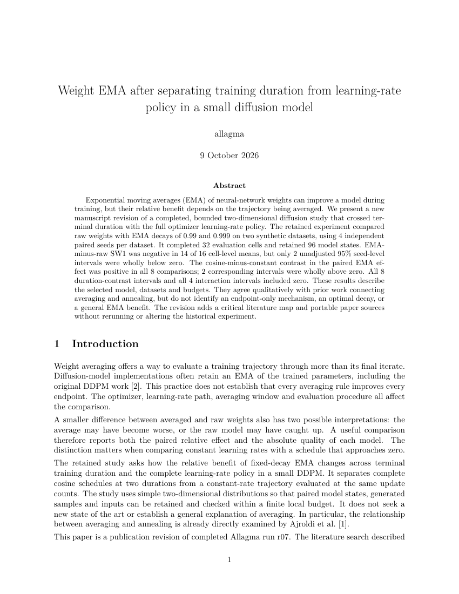

# A reference-grounded paper from the completed EMA study

This manuscript revision uses the completed r07 study. It adds a critical
literature map, bounded reference acquisition and a compiled paper with portable
sources. The original science, attempts, bundles, report and audits remain
unchanged. No new training or native model session was run.

[Read the paper](artifacts/review-r1/paper.pdf), [download its source archive](artifacts/review-r1/paper-source.tar.gz),
or start with the [reference index](references/INDEX.md). The paper's author label
`allagma` was explicitly supplied by the owner. Other researchers configure their
own attribution; it is not a framework default.



## What the reference research changed

The eight-entry map covers seven primary papers and the exact upstream code
snapshot. Each entry separates verified bibliographic metadata from located
source support, limitations and consequences for the study. The
[search record and critical map](references/map.json) identify competing findings
and untested baselines, with individual notes available on demand.

The search found Ajroldi et al. (2025), which directly studies averaging and
annealing. The manuscript therefore makes a bounded case-study claim rather
than presenting their qualitative relationship as new. Switch EMA supplies
actual counterexamples to universal ordinary-EMA benefit. Its intervention and
Morales-Brotons et al.'s bootstrapping experiment are kept distinct. The search
is a targeted narrative map, not an exhaustive systematic review, and was
conducted after the frozen experiment.

The [asset manifest](references/assets.json) pins seven PDFs and their available
TeX sources, three relevant upstream code files at commit
`1de1dbc1f4ee2c5f61e9c94348d55eb51d7fa2eb`, one real saved model artifact and
one held-out/generation split from r07. The [retrieval manifest](references/retrieval.json)
records 19 available assets, their hashes, sizes, relative cache paths and
licenses. Total transfers were 139,596,456 bytes; expanded source files account
for another 86,420,758 bytes. These raw files remain outside Git, releases and
Pages. Paper PDFs retained under arXiv's distribution license are not relicensed
for redistribution by this project.

## Recompute and rebuild without the cache

From the repository root, using Python 3.11+:

```sh
python3 studies/ema-schedule/publications/reference-r2/derive.py
python3 -m allagma reference check \
  --directory studies/ema-schedule/publications/reference-r2/references --require-review
python3 -m allagma paper check --study studies/ema-schedule/publications/reference-r2
python3 -m allagma paper build --study studies/ema-schedule/publications/reference-r2 \
  --destination work/my-paper-rebuild
python3 tools/verify_paper_output.py --directory work/my-paper-rebuild --author allagma
```

The paper build additionally needs an existing TeX distribution and OS isolation
(macOS Seatbelt or Linux bubblewrap). The final verification command uses
Poppler's `pdfinfo` and `pdftotext`. These dependencies belong to the optional
paper integration; the default conformance kit and toy study remain offline and
standard-library-only. No reference download, model account, scientific training
environment or cache is needed for these commands.

The source archive also works independently of the repository:

```sh
mkdir paper-source
tar -xzf paper-source.tar.gz -C paper-source
python3 paper-source/anc/build.py --output clean-paper-build
```

Use new output directories. `derive.py` recalculates all 114 retained summaries
from the selected seed-level measurements. It checks means, uncertainty,
sign-flip tests and leave-one-seed-out means, without repeating training or
extracting metrics from all saved samples. [Source selection](science/source-manifest.json)
binds each copied scientific file to the original package index. The complete
study's separate [restoration instructions](../../RESULTS.md#restore-and-reproduce)
remain the path to its full scientific package.

## Inspect or reacquire the references

For this machine's existing cache, a new CLI process can verify and reuse every
asset without network access:

```sh
python3 -m allagma reference verify-cache \
  --directory studies/ema-schedule/publications/reference-r2/references
python3 -m allagma reference acquire \
  --directory studies/ema-schedule/publications/reference-r2/references
```

For a new cache, `--online` explicitly permits retrieval of the public paper and
code assets. The model and dataset use `acquisition: provided`: restore the r07
package if needed, then provide a local JSON mapping their asset IDs to the
exact `package_path` files in that package. Keep this local binding outside Git.
The provenance URL points to the package index, not a direct download of those
individual arrays. A missing supplied asset produces an explicit unavailable
state and a nonzero exit, while successful downloads remain reusable.

Cache defaults are 256 MiB per asset, 512 MiB expanded, 1 GiB per study, 4 GiB
per cache and 20 GiB minimum free disk. Transfers, retries, failed extraction,
quarantine and protected input copies are accounted for. The initial TLS failures
from the Mac's missing Python CA link remain in the acquisition ledger; the
adapter now uses the existing system trust bundle without disabling verification.
The explicit gates for terms and adopted-limit expansion were exercised by
offline conformance cases; no gated terms or larger limits were accepted here.

## Retained validation

[Integration evidence](evidence/integration.json) records offline reuse with an
unchanged transfer count, immutable preparation and the selected assets.
[The actual broker probe](evidence/reference-input-inspection.json) read 36 model
arrays and two evaluation arrays, with network, protected-input writes and
shared-cache reads denied. An earlier preparation is retained; a new preparation
revision clarifies the evaluation-file description without changing its bytes.

[Scientific review](reviews/pr14-scientific.json) and [humanizer review](reviews/pr14-humanizer.json)
are bound to the manuscript, section roles, citations, attribution and selected evidence.
They are same-assistant reviews, not independent peer review. The
[delivery receipt](artifacts/review-r1/delivery.json) binds the PDF and source archive to
two clean builds, including invocation of the unpacked archive's own builder. The
[PDF inspection](evidence/pdf-review-pr14.json) records the page review. Local TeX
Live 2024 results are identified separately from the supported-release CI check.
No arXiv processing or acceptance is claimed, and no submission was made.

The PR review repairs changed packaging and review identity. The manuscript and
PDF bytes remain unchanged. The original [scientific review](scientific-review.json),
[prose review](humanizer-review.json) and [delivery](artifacts/delivery.json) remain
as historical evidence. The current archive isolates reading notes from generated
ancillary files. [Repair evidence](../../../../docs/contributing/pr14-revisions.md)
records all four findings and their regressions.
